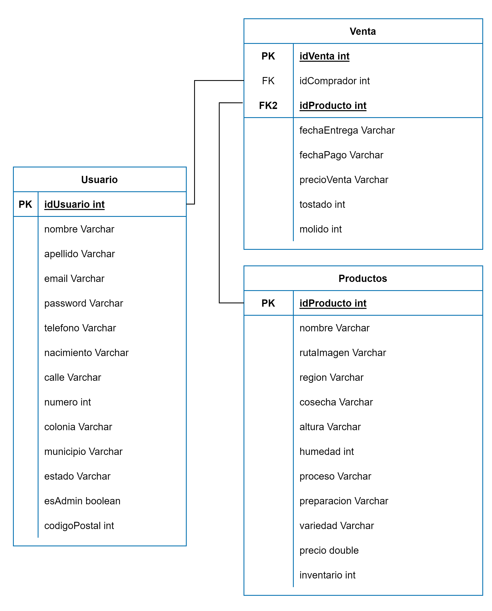

# Ecommerce Cafe Alfonso

## Despliegue en GitHub Pages

https://coffeeindevs.github.io/Ecommerce_CH24

## **Definición del proyecto**

Se ha observado que las cafeterías pequeñas
no siempre tienen buenas relaciones con productores cafetaleros, ya que grandes
empresas han introducido productos que opacan la presencia de pequeños
productores cafetaleros artesanales. Café Alfonso busca acercar los productos
de estos pequeños productores a las cafeterías de México buscando visibilizar
la calidad de estos productores,
promover la cultura cafetalera y apoyar el trabajo de cientos de
mexicanos.

### Misión

Brindar un Acompañar a nuestros clientes cuando sea y
donde sea con un delicioso café que les brinde felicidad y satisfacción.

### Visión

Impulsar para 2024 la comercialización del café producido
en México a nivel Nacional e Internacional, fomentando la cultura cafetalera
mexicana.

## **Desarrollo**

Tecnologías utilizadas

| Front End         | Back End    | Base de datos | Control de versiones |
| ----------------- | ----------- | ------------- | -------------------- |
| HTML5             | JAVA        | MYSQL         | Git                  |
| CSS3              | Spring Boot |               | GitHub               |
| Bootstrap 5       |             |               |                      |
| ECMAScript 6 (JS) | Postman     |               |                      |

## Diagrama Entidad Relacion

